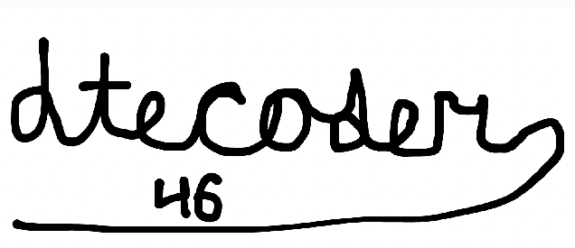

# Overview
This is a brief program written in Haskell that generates a numbet based on a YouTube link input from the user (could be a link to your favorite song, your own video, or the YouTube main page). The length of the link is determined and thrn compared to the number 50. If it's higher than 50, 5 is added to it and the finsl number is shown. If it's lower, the number is multiplied by 5 and the final number is shown.

## Point of clarification
For those of you who are new to Haskell, you might be confused why I went from using putStrLn to using print in my code. 

The reason for this is that putStrLn can only accept *string values* (aka words), while print can accept *numbers* (which need to be displayed at the end of the program).

For example, this code would give an error..

~~~haskell
if lenlink > 50
  then putStrLn(lenlink + 5)
else putStrLn(lenlink * 5)
~~~

...while this code wouldn't.

~~~haskell
if lenlink > 50
  then print(lenlink + 5)
else print(lenlink * 5)
~~~

# Note of Warning
If you are planning ti code in Haskell like I did, ***please think carefully***. While Haskell might seem like a good option due to type safety (meaning that it can easily detect errors involving mismatch between word-input functions and numerical input ahead of time) and such, it has its downsides. In my opinion, Haskell's limitations makes it tedious to code in it. 

For example, Haskell **has no built-in for loops or random number functions** (the latter being my reason for making this Haskell program). As a result, your coding might often be interrupted by being forced to look at a Haskell tutorial or a Stack Overflow post, slowing down youf progress.

So while I am *NOT* saying Haskell is the worst programming language, I am advising you to consider the pros and cons before fully committing to Haskell.

